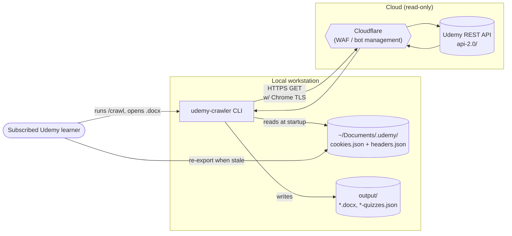
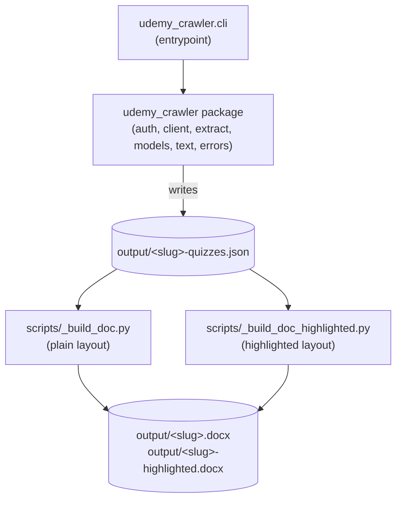
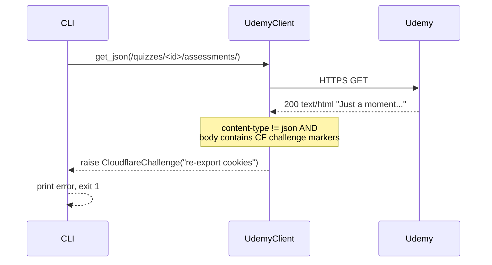
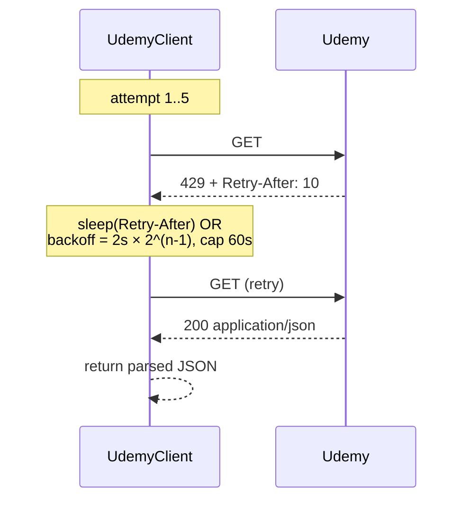
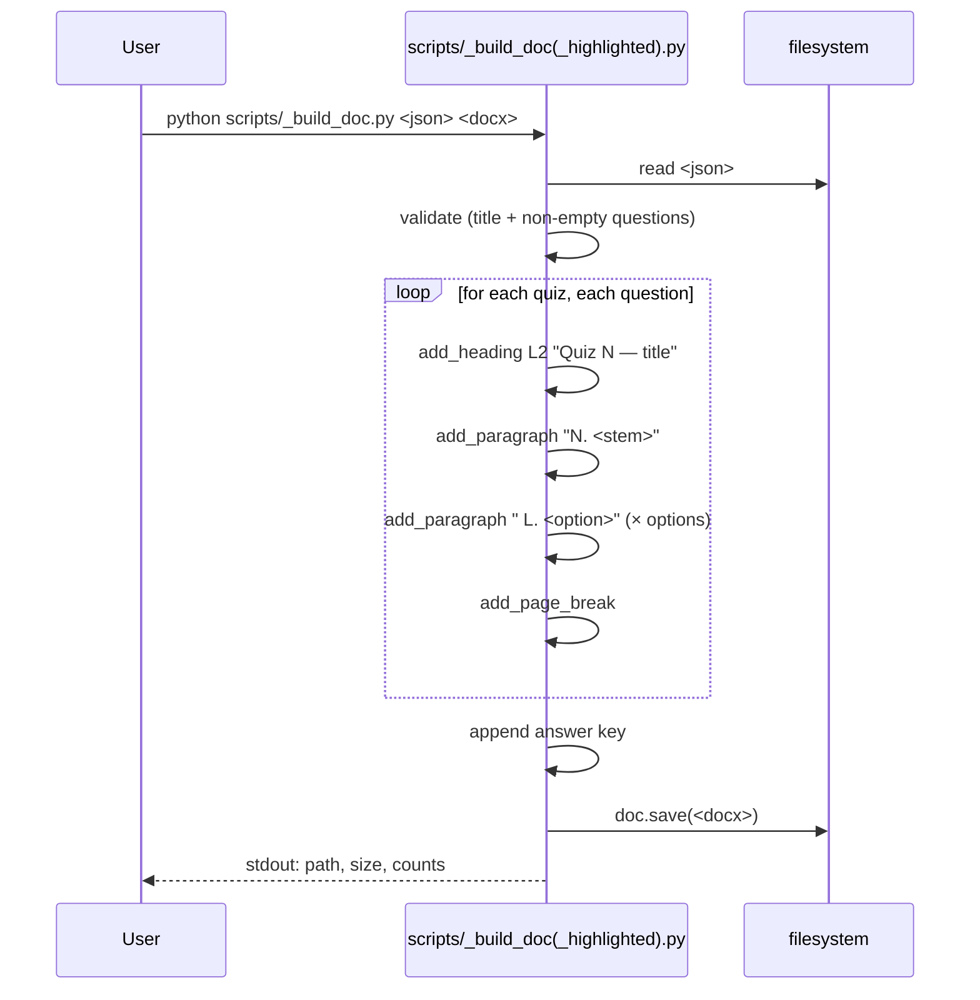

# Architecture Documentation — `udemy-crawler`

Structured per the [arc42 template](https://arc42.org). Sections are sized to the system: small project, small doc, but every section is real — no padding.

---

## 1. Introduction and Goals

### 1.1 Requirements overview

Owners of paid Udemy practice-test courses need an offline study artefact — searchable, printable, annotatable. The native Udemy UI requires a logged-in browser session and renders one question at a time inside a JavaScript app; there is no native export.

`udemy-crawler` is a single-user command-line tool that, given a quiz-series URL, produces a `.docx` containing every question, every option, and the correct answer. It runs as the authenticated subscriber and uses only documented-by-shape REST endpoints (the ones Udemy's own web app calls).

### 1.2 Quality goals

Listed in priority order. The earlier ones win when they conflict with the later ones.

| # | Goal | Why it matters |
| --- | --- | --- |
| 1 | **Correctness** of extracted question text and answer key | The whole tool is useless if a single answer is wrong. |
| 2 | **API politeness** — no bursts, respect rate signals | Risk of account suspension is asymmetric: small upside, catastrophic downside. |
| 3 | **Fail-fast** on bad auth or unexpected API shape | A silent half-extracted output is worse than a clear error. |
| 4 | **Re-runnability** — full re-crawl is cheap, JSON cache means docx regen is free | The user iterates on layout, not on extraction. |
| 5 | **Read-only** posture toward Udemy | No quiz submission, no state changes, no answer-revealing POSTs. |

### 1.3 Stakeholders

| Role | Concern |
| --- | --- |
| End user (the developer running it on their own course) | Wants their material out, fast, correct. |
| Udemy (implicit, non-consenting stakeholder) | The tool should not hammer their API or modify state on their platform. |
| Future contributor | Wants to add courses with different API shapes without re-architecting. |

---

## 2. Architecture Constraints

Constraints that the architecture had to accept, not invent.

| Constraint | Source | Consequence |
| --- | --- | --- |
| Python 3.11+ | CLAUDE.md stack choice | `dataclasses`, modern typing throughout. |
| Windows-first execution | User's environment | All paths use `pathlib.Path`; no shell-isms. |
| Udemy fronted by Cloudflare | Discovered during `/explore-udemy` on 2026-05-19 | Cannot use `httpx`, `requests`, or `Invoke-WebRequest`; must impersonate a real browser. |
| Cookie-only auth (no Bearer token) | Same exploration session | Captured traffic had no `Authorization` header. Auth state is a cookie set, not a single secret string. |
| Cookies expire (hours) | Cloudflare design | Architecture must surface expiry as a distinct, recoverable failure mode — not a generic 5xx. |
| One request at a time, ≥ 500 ms apart, exponential backoff on 429 | `.claude/rules/crawler-conventions.md` | No parallel quiz extraction; sequential `time.sleep` floor. |
| Token storage outside the repo | `CLAUDE.md > Authentication` | `~/Documents/.udemy/` is the canonical home; the repo never sees a credential. |
| `.claude/` is committed scaffold | CLAUDE.md layout | Skills, agents, rules, slash commands all version-controlled and reviewable. |

---

## 3. System Scope and Context

### 3.1 Business context



### 3.2 Technical context — what we do and don't talk to

| External system | Direction | Protocol | Notes |
| --- | --- | --- | --- |
| Cloudflare → Udemy REST | Outbound only | HTTPS GET, browser-mimicked TLS | All API calls go through CF. The crawler treats them as a single endpoint. |
| Local filesystem | Read + write | Native | Reads `~/Documents/.udemy/`, writes `output/`. |
| User's browser (out-of-band) | None at runtime | — | Used by the human only, to capture cookies. No browser automation. |

**Explicitly out of scope:** quiz submission, comments, progress tracking, video downloads, course discovery, multi-tenant operation, cloud deployment.

---

## 4. Solution Strategy

The four top-level decisions that shape everything else. Each is recorded in detail as an ADR in [§9](#9-architectural-decisions).

1. **Browser-fingerprinted client** ([ADR-1](#adr-1-curl_cffi-over-httpx)). Cloudflare blocks generic HTTP clients on the TLS handshake. `curl_cffi` with `impersonate="chrome124"` is the cheapest way through and doubles as a defensive moat against future fingerprinting tightening.
2. **Cookie auth, no Bearer token** ([ADR-2](#adr-2-cookie-based-auth-instead-of-bearer-token)). The captured browser traffic had no `Authorization` header. The CLAUDE.md brief assumed otherwise; exploration disproved it. Auth state = cookie bag.
3. **Explore-then-codify** ([ADR-3](#adr-3-explore-then-codify-no-pre-baked-api-knowledge)). The Udemy API shape is not pre-known. `/explore-udemy` is a real bootstrap step that probes endpoints and writes findings into `.claude/skills/extract-quiz/SKILL.md`. `/crawl` refuses to run on the un-codified stub.
4. **Two-stage pipeline** ([ADR-4](#adr-4-two-stage-pipeline-crawl-json-docx)). The crawler emits a structured JSON dump; a separate script turns that into a `.docx`. Splitting the stages means docx layout is iterable without re-crawling (a 5-minute round trip becomes a 2-second round trip).

---

## 5. Building Block View

### 5.1 Level 1 — system overview



The first stage (Python package) handles network. The second stage (build scripts) is pure data transformation — no network, no state.

### 5.2 Level 2 — inside `udemy_crawler`

| Module | Responsibility | Public surface | Talks to |
| --- | --- | --- | --- |
| `cli.py` | Parse URL → slug, orchestrate the walk, dump JSON. | `main(argv)` | `auth`, `client`, `extract` |
| `auth.py` | Load `cookies.json` and `headers.json` from `~/Documents/.udemy/`. Wrap cookies in `SecretCookies` so they redact in `repr`. | `load_auth()`, `SecretCookies` | filesystem only |
| `client.py` | `UdemyClient` — `curl_cffi` session with throttle, exponential backoff on 429, Cloudflare-challenge detection. Returns parsed JSON or raises a named exception. | `UdemyClient.get_json(url, *, referer=None)` | `auth`, network |
| `extract.py` | Three pure functions: `resolve_course_id`, `list_quizzes`, `extract_quiz`. Each follows pagination per [crawler-conventions.md](.claude/rules/crawler-conventions.md). | the three functions above | `client`, `models`, `text` |
| `models.py` | `Option`, `Question`, `Quiz` dataclasses. The contract between extraction and doc-build. | the three dataclasses | none |
| `text.py` | `clean_html()` — `html.unescape` + regex tag strip + whitespace collapse. | `clean_html(s)` | stdlib only |
| `errors.py` | Named exception hierarchy: `CrawlerError → AuthMissing, AuthInvalid, CloudflareChallenge, RateLimited, CourseIdUnresolved`. | the six classes | none |

Module-size convention from [`code-style.md`](.claude/rules/code-style.md): ≤ 300 lines, single cohesive responsibility per module. Current largest is `client.py` at ~80 lines.

### 5.3 Level 2 — the build scripts

The two build scripts are intentionally near-duplicates. `_build_doc_highlighted.py` differs only in `_add_option` — applying `WD_COLOR_INDEX.YELLOW` and `run.bold = True` to the correct option line. Refactoring to a `--highlight` flag was considered and rejected (see [ADR-5](#adr-5-two-build-scripts-not-one-with-a-flag)).

Both follow `.claude/skills/generate-word-doc/SKILL.md` literally — that skill file is the authoritative layout spec.

---

## 6. Runtime View

### 6.1 The happy path: `/crawl <url>`

```mermaid
sequenceDiagram
    autonumber
    actor U as User
    participant CLI as cli.main
    participant A as auth.load_auth
    participant C as UdemyClient
    participant X as extract.*
    participant Udemy as Udemy API (via Cloudflare)
    participant FS as filesystem

    U->>CLI: python -m udemy_crawler.cli <url>
    CLI->>A: load_auth()
    A->>FS: read cookies.json + headers.json
    A-->>CLI: (SecretCookies, headers)
    CLI->>C: UdemyClient()  (impersonate=chrome124)
    CLI->>X: resolve_course_id(slug)
    X->>C: get_json(/courses/<slug>/?fields[course]=id)
    C->>Udemy: HTTPS GET (Chrome TLS, full cookie bag)
    Udemy-->>C: 200 {id: &lt;course-id&gt;}
    C-->>X: parsed JSON
    X-->>CLI: &lt;course-id&gt;
    CLI->>X: list_quizzes(course_id)
    loop until next == null
        X->>C: get_json(curriculum-items?page=...)
        Note over C: throttle ≥ 500 ms<br/>between requests
        C->>Udemy: HTTPS GET
        Udemy-->>C: 200 {results: [...], next: ...}
        C-->>X: parsed JSON
    end
    X-->>CLI: [{quiz1}, ..., {quizN}]
    loop for each quiz in series
        CLI->>X: extract_quiz(quiz_id)
        loop until next == null
            X->>C: get_json(/quizzes/<id>/assessments/?page_size=250)
            C->>Udemy: HTTPS GET
            Udemy-->>C: 200 {results: [assessment, ...]}
            C-->>X: parsed JSON
        end
        X-->>CLI: Quiz(...)
    end
    CLI->>FS: write output/<slug>-quizzes.json
    CLI-->>U: stdout: path to JSON
```

For the exploration target (5 quizzes × 100 questions): 1 + 1 + 5 = 7 API calls total, ~7×0.5 s throttle + ~7×0.2 s round-trip ≈ 5 s wall time. Adding more questions to a quiz would not change the count; the assessments endpoint returns all 100 in one page at `page_size=250`.

### 6.2 Two failure modes worth depicting

#### Cookies expired



The detection is content-based, not status-based: Cloudflare returns 200 OK for the challenge page. The client distinguishes JSON from challenge HTML, raises a specific named exception, and the CLI exits non-zero with the renewal instructions.

#### 429 rate-limited



Five attempts max. After that the client raises `RateLimited` and the crawl fails. The retry budget per [`crawler-conventions.md`](.claude/rules/crawler-conventions.md) intentionally favors backing off over hammering.

### 6.3 Doc generation (post-crawl)



Pure transformation: no network, deterministic given the JSON input. Same input → byte-identical docx (modulo `python-docx`'s embedded timestamps).

---

## 7. Deployment View

There is one deployment: a developer workstation.

| Component | Location | Lifecycle |
| --- | --- | --- |
| `udemy-crawler` source | `C:\…\udemy-crawler\` (git checkout) | Pulled from GitHub; updated on demand. |
| Python interpreter | System / venv | Outside the project's control. Tested on 3.14. |
| `curl_cffi`, `python-docx` | pip-installed into the active environment | Manual `pip install`. No `pyproject.toml` / lockfile yet — see [§11](#11-risks-and-technical-debt). |
| Auth files | `~/Documents/.udemy/cookies.json` + `headers.json` | Manually exported from browser. Expire in hours. |
| Output artefacts | `<repo>/output/` (gitignored) | Overwritten on each crawl. |
| Claude Code (optional) | Runs the slash commands | Reads `.claude/` scaffold from the repo. |

There is no server, no daemon, no scheduler. Each crawl is a one-shot foreground process.

---

## 8. Cross-cutting Concepts

### 8.1 Auth handling

A single `auth.load_auth()` is the only place the crawler touches the filesystem for credentials. It returns a `SecretCookies` instance — a `dict` subclass whose `__repr__` and `__str__` are redacted, so an accidental `print(cookies)` or an exception message containing the dict does not leak the bag. Headers are returned as a plain `dict` because they contain no secrets (the `x-udemy-cache-*` headers are scoping hints, not credentials).

If the directory or either file is missing, `AuthMissing` is raised with an actionable message naming the missing path.

### 8.2 Error model

All domain errors descend from `CrawlerError`. Each one has a single, named meaning:

| Exception | Meaning | Recovery |
| --- | --- | --- |
| `AuthMissing` | `~/Documents/.udemy/` or its files don't exist or aren't JSON. | User creates / repairs the files. |
| `AuthInvalid` | API returned 401 (stale cookies) or 403 (not subscribed). | Re-export cookies (401) or buy the course (403). |
| `CloudflareChallenge` | Got HTML instead of JSON; `cf_clearance` / `__cf_bm` expired. | Re-export cookies. |
| `RateLimited` | 429 after the retry budget was exhausted. | Wait and re-run. |
| `CourseIdUnresolved` | The slug → numeric-id lookup didn't return an `id`. | Inspect URL; possibly the slug is wrong. |

`cli.main` catches `CrawlerError` at the top level, prints a one-line message, exits 1. No traceback to the user. Per [`code-style.md`](.claude/rules/code-style.md): catch named exceptions at the boundary, not in business logic.

### 8.3 Rate limiting and backoff

Implemented inside `UdemyClient`:

- **Throttle:** `_throttle()` ensures ≥ 500 ms between any two outgoing requests. Uses `time.monotonic()`, not wall clock — robust to NTP corrections.
- **429 backoff:** exponential, starting at 2 s, doubling, capped at 60 s. `Retry-After` header overrides the schedule when present.
- **Budget:** 5 attempts per URL. On the 6th would-be call, raise `RateLimited`.

Both numbers come straight from [`crawler-conventions.md`](.claude/rules/crawler-conventions.md) and are deliberately conservative — the [§1.2](#12-quality-goals) #2 goal (API politeness) outranks #4 (re-runnability).

### 8.4 HTML cleanup

Udemy serves question text and option text as HTML strings with entities (`&quot;`, `&#x27;`, `&amp;`) and occasional inline tags. `text.clean_html()` does `html.unescape()` + regex tag strip + whitespace collapse. It is not a full HTML-to-text converter and explicitly does not preserve formatting — the `.docx` renders plain text.

A pre-formatted code block convention exists in `generate-word-doc/SKILL.md` (render `<pre>`/`<code>` in Courier New 10pt) but is not yet implemented. None of the questions in the exploration corpus contained code.

### 8.5 Cloudflare challenge detection

The client treats `content-type` as the primary signal: if the response is not `application/json` and the body contains any of `Just a moment`, `cf-mitigated`, or `challenge-platform`, raise `CloudflareChallenge`. Status code is *not* used — Cloudflare returns 200 OK for the challenge page, which would otherwise be invisible to a status-based check.

### 8.6 Pagination

Two endpoints paginate, both link-based:

- `cached-subscriber-curriculum-items/` — `next` URL until null.
- `quizzes/<id>/assessments/` — same. In practice `page_size=250` returns all 100 questions in one page, but the code follows `next` defensively.

Per [`crawler-conventions.md`](.claude/rules/crawler-conventions.md), the crawler never computes pages from `count` / `page_size`. The `count` field is observed to occasionally lie.

---

## 9. Architectural Decisions

ADRs are kept inline (rather than in `docs/adr/00N-*.md`) because the project is small and the decisions are tightly coupled to each other. If the count grows past ~10, split.

### ADR-1: `curl_cffi` over `httpx`

- **Status:** Accepted
- **Date:** 2026-05-19 (during `/explore-udemy`)

**Context.** CLAUDE.md originally specified `httpx` as the HTTP client. The first four probes via PowerShell `Invoke-WebRequest` (a more conservative client than `httpx` — fewer security wrinkles, similar TLS posture) all received Cloudflare's "Just a moment..." JavaScript challenge instead of JSON. Cookies were valid; the discriminator was the TLS fingerprint.

**Decision.** Use `curl_cffi` (`pip install curl_cffi`) with `impersonate="chrome124"` everywhere. Replace the originally-specified `httpx` in CLAUDE.md.

**Consequences.**
- ✅ Cloudflare-cleared on first try after switching; all four probes returned 200 JSON.
- ✅ Future-proof: when Cloudflare tightens detection, `curl_cffi` updates Chrome versions in lockstep.
- ❌ `respx` (the `httpx` mocking library) is no longer applicable; testing rule was updated to recommend `pytest-httpserver`.
- ❌ One more native dependency (libcurl + impersonation patches), slightly fatter install.

### ADR-2: Cookie-based auth instead of Bearer token

- **Status:** Accepted
- **Date:** 2026-05-19

**Context.** CLAUDE.md assumed the canonical Udemy auth pattern: a Bearer token at `~/Documents/.udemy/token`. The captured browser traffic carried **no `Authorization` header** — all auth flowed through cookies (`access_token`, `dj_session_id`, `ud_user_jwt`, plus Cloudflare's `cf_clearance` / `__cf_bm`).

**Decision.** Auth lives at `~/Documents/.udemy/cookies.json` (a flat `{name: value}` map) plus `headers.json` (non-cookie request headers Udemy expects). No Bearer token is sent.

**Consequences.**
- ✅ Matches Udemy's actual wire format; no guessing.
- ❌ `cf_clearance` / `__cf_bm` are browser-bound and expire in hours. Re-export is a manual step.
- ❌ More cookies to keep track of than a single token. Partially mitigated by the `SecretCookies` redacting `repr`.

### ADR-3: Explore-then-codify (no pre-baked API knowledge)

- **Status:** Accepted
- **Date:** Pre-2026-05-19 (original project brief)

**Context.** The Udemy API surface drifts over time. Embedding hardcoded endpoint paths and JSON field locators in source code is fragile: it works until Udemy renames a field, at which point the failure mode is silent wrong data.

**Decision.** `/explore-udemy` is a real bootstrap step — a separate slash command and skill that probes endpoints with a real account, observes the JSON shape, and writes findings into `.claude/skills/extract-quiz/SKILL.md`. `/crawl` checks for the literal stub marker `STUB —` in that file and refuses to run if found.

**Consequences.**
- ✅ Onboarding a new course type is "run `/explore-udemy` once, then `/crawl` for that course family."
- ✅ The skill file is the contract — diff-reviewable, version-controlled.
- ❌ Two-step UX for first-time use. Tolerable.

### ADR-4: Two-stage pipeline (crawl → JSON → docx)

- **Status:** Accepted
- **Date:** 2026-05-19

**Context.** The natural code shape was "crawl and emit `.docx` in one process." But docx layout is highly iterable (margins, headings, page breaks, highlighting), while crawling is slow and rate-limited.

**Decision.** The CLI dumps a structured JSON file (`output/<slug>-quizzes.json`). Separate build scripts (`scripts/_build_doc.py`, `_build_doc_highlighted.py`) consume that JSON and produce the `.docx`. The doc-writer Claude agent uses the same JSON as a serialization contract.

**Consequences.**
- ✅ Iterating on layout is a 2-second rebuild, not a 5-minute re-crawl.
- ✅ The JSON is also a debuggable artefact — if a question looks wrong, grep the JSON before grepping the docx.
- ❌ One more file to manage. Acceptable; it's gitignored.

### ADR-5: Two build scripts, not one with a flag

- **Status:** Accepted
- **Date:** 2026-05-27

**Context.** `_build_doc.py` and `_build_doc_highlighted.py` differ only in `_add_option`, which applies a yellow highlight + bold to correct options. The DRY instinct says "add a `--highlight` flag to one script."

**Decision.** Keep them as separate files.

**Consequences.**
- ✅ Each script reads top-to-bottom with no conditionals. The "what does this produce?" question is answered by the filename.
- ✅ The user's workflow runs both unconditionally, producing both artefacts. A flag would not have saved time.
- ❌ Two places to maintain if the layout changes. Cost is low because the SKILL.md spec is the source of truth; both scripts are mechanically derived from it.

### ADR-6: One question per page

- **Status:** Accepted (superseded the original "one quiz per page")
- **Date:** 2026-05-27

**Context.** The first cut of `generate-word-doc/SKILL.md` put one quiz on one page — fine for small quizzes, but the exploration corpus had 100 questions per quiz, so a "quiz page" was 12 screens deep and impossible to flick through.

**Decision.** One question per page. The quiz heading (`Quiz N — title`) repeats at the top of every page so each page is self-contained. Question numbering resets to 1 at each quiz boundary.

**Consequences.**
- ✅ Each page reads like a flashcard; print-friendly.
- ✅ Searching the docx jumps cleanly to the question.
- ❌ Doc size is ~5× the original (500 pages vs. ~100 across all quizzes). Still under 130 KB, immaterial.

### ADR-7: No resume, no cache, no parallelism

- **Status:** Accepted (deliberate v1 deferral)
- **Date:** Pre-2026-05-19

**Context.** Obvious optimizations exist: cache responses, resume mid-series after a failure, fetch quizzes in parallel.

**Decision.** None of these in v1. Each crawl is fresh, sequential, single-process. The retry budget on 429 covers transient failures; the JSON dump covers the "I want the docx but already crawled" case.

**Consequences.**
- ✅ Code stays simple. No cache invalidation, no resume cursor, no concurrency primitives.
- ✅ API anger surface stays small. Sequential + 500 ms floor is well below any plausible Udemy rate limit.
- ❌ A failed crawl mid-series wastes work. Acceptable: 5 quizzes × 5 s = 25 s; users don't re-run often.

---

## 10. Quality Requirements

Goals from [§1.2](#12-quality-goals), made concrete.

| Goal | Operationalization | Currently met? |
| --- | --- | --- |
| Correctness | Question text + options + correct-letter must match the Udemy UI verbatim (modulo HTML entity normalization). Spot-checked manually during the exploration run. | Yes for the one tested course. No automated regression test yet. |
| API politeness | ≥ 500 ms between requests; ≤ 5 retries on 429; sequential only. Enforced in `UdemyClient`. | Yes. |
| Fail-fast | Six named exception classes; all raised at the boundary, all surface as one-line CLI errors with exit code 1. | Yes. |
| Re-runnability | Crawl emits JSON; docx rebuild reads JSON only (no network). | Yes. |
| Read-only posture | All requests are GETs. No POST to `assessment-answers/`. Reviewable in `extract.py`. | Yes. Enforced by code review only — no test. |

---

## 11. Risks and Technical Debt

### Risks

| # | Risk | Likelihood | Impact | Mitigation / next step |
| --- | --- | --- | --- | --- |
| R1 | `cf_clearance` expiry mid-crawl | High (hourly) | Crawl fails partway, partial JSON | Detected as `CloudflareChallenge`; user re-exports cookies and re-runs. Future: a small `refresh-auth` helper that re-parses a freshly-pasted fetch. |
| R2 | Udemy API field renames | Low per quarter, high cumulative | Silent wrong data | The `/explore-udemy` workflow exists for re-codification, but there is no detection. Adding a JSON-shape assertion in `extract.py` would help. |
| R3 | Multi-answer questions never tested | Unknown | Wrong answer key for multi-select quizzes | Data model supports it; spot-check on a course known to use multi-answer is open work. |
| R4 | Course-id lookup via `/api-2.0/courses/<slug>/?fields[course]=id` may not exist for all course states (unpublished, restricted) | Unknown | `CourseIdUnresolved` raised | Add a `--course-id` override flag to `cli.py`. |
| R5 | Cloudflare tightens detection past `curl_cffi`'s impersonation | Low short-term, high long-term | Crawler stops working | Update `curl_cffi` pin; in the worst case, browser-automation fallback (Playwright) — a heavier dependency. |
| R6 | User runs the docx generator on stale JSON after course content changes | Low | Outdated docx | The JSON is gitignored and timestamped only by mtime. A `crawled-at` field in the JSON would make staleness visible. |

### Technical debt

- **No tests.** `pytest-httpserver` is the prescribed approach in `testing.md` but no tests are written. The smoke test for the live API exists in commit messages, not in code.
- **No `pyproject.toml` / lockfile.** Dependencies are documented in README only. Pinning `curl_cffi` and `python-docx` would prevent surprise breakage.
- **No CLI flag layer.** `cli.py` reads `sys.argv[1]` directly. `typer` was in the original CLAUDE.md stack and would slot in cleanly for a `--course-id` override, `--output-dir`, etc.
- **Cookie persistence is a throwaway script.** `.claude/skills/explore-udemy/.scratch/persist_auth.py` works but is gitignored. Promote to a first-class `scripts/refresh_auth.py` (or `udemy_crawler.cli auth refresh`).
- **No retry on transient network errors.** The client retries on 429 only. A `curl_cffi`-level connection reset gets no retry; the crawl just fails. Adding a small retry-on-transient layer is a single-function change.
- **Doc-writer agent and Python script have duplicated layout knowledge.** The `generate-word-doc/SKILL.md` is the spec; the build scripts and the agent both implement it independently. A test that re-builds via both paths and diffs the XML would close that loop.

---

## 12. Glossary

| Term | Meaning |
| --- | --- |
| **course_id** | Udemy's numeric course identifier (a 7-digit integer). Not in the URL path; must be looked up from the slug. |
| **slug** | The URL-friendly course name (the path segment after `/course/` in any Udemy URL). |
| **quiz** | A practice test inside a course. Each is a list of assessments. |
| **assessment** | Udemy's term for a single question (with stem, answers, correct response, explanation). |
| **practice-test** | The `type` value Udemy uses for graded multi-question quizzes. |
| **cf_clearance** | Cloudflare cookie issued after a successful browser challenge. Required for any non-static request. |
| **__cf_bm** | Cloudflare bot-management cookie. Short-lived (~30 min). |
| **impersonate** | `curl_cffi` parameter that selects which browser's TLS fingerprint to mimic. The project uses `chrome124`. |
| **skill** | A `.claude/skills/<name>/SKILL.md` file containing the codified procedure for an agent or slash command. |
| **agent** | A subprocess with restricted tools and a focused mission (`page-explorer`, `quiz-extractor`, `doc-writer`). |
| **slash command** | A user-facing entry point (`/explore-udemy`, `/crawl`) defined in `.claude/commands/`. |
| **explore-then-codify** | The pattern of probing an unknown API once, writing what was learned into a skill file, and then running against that skill. See [ADR-3](#adr-3-explore-then-codify-no-pre-baked-api-knowledge). |
